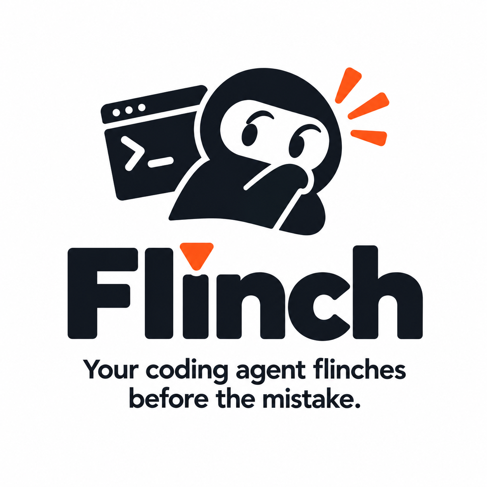

<p align="center">
  
</p>

Flinch is a [Claude Code](https://code.claude.com) plugin that watches each step your agent takes. It asks a fast classifier a yes-or-no question about the step and nudges the agent when something looks wrong. You don't have to be watching: it catches loops, risky commands, broken project rules, and "done!" claims that were never checked.

> **Status: pre-release.** Flinch is in active development and not yet published. The commands below describe v0.1 as designed.

```
● Bash(dotnet test)  ✗ 3 failed
  ⤷ flinch: same failure 3 times in a row. Stop retrying, read the error, change approach.

● Edit(src/Orders/OrderQueries.cs)
  ⤷ flinch: this edit may break "tenant-filter": every query on a tenant-owned table filters by TenantId.

● "Fixed! The bug is resolved."
  ⤷ flinch: you said it's done, but nothing has been tested since your last edit. Verify first.
```

## What it checks

| Check | When | What it catches |
|---|---|---|
| **Stuck** | After each tool call | The same failure again and again, editing in circles, flailing |
| **Risky command** | Before each shell command | Destructive or outward-facing commands: force-push, `rm -rf`, publishing, deploying |
| **Unproven done** | When the agent tries to finish | Claiming success with no test or build run since the last edit |
| **Your rules** | After each edit | Code that breaks a rule from your own project rules (see [Rules](#rules)) |
| **Drift** | After each tool call | Work that has wandered away from what you asked for |

Every check can be turned on or off on its own.

## Install

In Claude Code:

```
/plugin marketplace add awardspring/flinch
/plugin install flinch@flinch
```

That's it. Flinch works right away using your existing Claude Code login (see [Backends](#backends)).

## Backends

Each check is one small multiple-choice question. Flinch sends it to the fastest backend you have:

1. **[Jev](https://typesafe.ai/)** (recommended). Paste a key when the plugin asks, or set `JEV_API_KEY`. Verdicts come back in about 100ms, so every check runs before the agent's next step.
2. **Anthropic API.** Used when `ANTHROPIC_API_KEY` is set. It's slower, so most checks run in the background and speak up only when they find something.
3. **Claude Code itself.** Always available, with no key needed. It uses your existing login and counts against your Claude plan's limits.

`flinch status` shows which backend is active.

## Modes

- **Nudge (default):** Flinch tells the agent what it noticed, and the agent decides what to do.
- **Block:** a risky command needs your approval, a rule-breaking edit has to be fixed or explained, and an unproven "done" is sent back.

```json
// .flinch.json in your project root (all fields optional)
{
  "mode": "nudge",
  "checks": { "stuck": true, "risky": true, "done": true, "rules": true, "drift": false },
  "threshold": 0.8,
  "rules": ".flinch/rules.json"
}
```

## Rules

The rules check works from your project's own rules. Write them in `.flinch/rules.json`, one sentence each:

```json
{
  "rules": [
    { "id": "tenant-filter", "applies": ["**/*.cs"], "rule": "Every query on a tenant-owned table filters by TenantId." },
    { "id": "no-raw-hex", "applies": ["**/*.scss"], "rule": "Use color tokens, never raw hex values." }
  ]
}
```

| Field | Meaning |
|---|---|
| `id` | Short name, shown in nudges and in `flinch log` |
| `applies` | File patterns the rule covers. Only rules matching the edited file are sent with a check, so narrow patterns keep checks fast and accurate |
| `rule` | One sentence the agent's edit is judged against |

**Getting started.** Run `flinch rules init` to draft the file from your `CLAUDE.md` / `AGENTS.md`, or copy a starter set from [`examples/`](examples/) and edit it. Then trim it. Ten sharp rules beat forty vague ones.

**Commit it.** `.flinch/rules.json` belongs in your repository, so everyone on the team, and every agent, is held to the same rules.

### Writing rules that work

Flinch judges one edit at a time, with nothing but the rule and the changed lines. A good rule is one a careful reviewer could check by looking at just that diff.

| Works well | Works poorly | Why |
|---|---|---|
| "Every query on a tenant-owned table filters by TenantId." | "Keep tenant data isolated." | Name the thing you'd see in the code |
| "No raw hex colors in stylesheets; use the color tokens." | "Follow the design system." | One concrete check, not a whole document |
| "Controller actions only call a service; no database queries in controllers." | "Keep controllers thin." | "Thin" is a judgment; "no queries" is visible |
| "Async functions that do I/O take a cancellation token." | "Write good async code." | Vague rules turn into false alarms |

Avoid rules about taste, tone, or comment style. In our own testing, judgment-call rules caused most of the false alarms while concrete rules stayed accurate. If a rule needs context outside the edit to decide, such as "this file must also be registered elsewhere", Flinch can't see it and will stay quiet.

### Test your rules

Before you turn on block mode, check your rules against real edits from your own history:

```bash
flinch eval --rules .flinch/rules.json --cases .flinch/cases.jsonl
```

Each line of `cases.jsonl` is one real edit, labeled with the rule it breaks or `"none"`:

```json
{"id": "c01", "expected": "tenant-filter", "file_path": "src/Orders/OrderQueries.cs", "diff": "@@ ... @@\n+ var orders = db.Orders.Where(o => o.Status == status);"}
```

Include clean edits, especially near misses, as well as rule-breaking ones. `flinch eval` reports catches, misses, wrong-rule answers, and false alarms. A rule that raises false alarms should be rewritten to be more concrete, or removed.

## Commands

| Command | What it does |
|---|---|
| `flinch status` | Active backend, mode, and enabled checks |
| `flinch log` | What Flinch caught, when, and which backend decided |
| `flinch rules init` | Draft `.flinch/rules.json` from your agent instructions |
| `flinch eval` | Score your rules against a labeled set of real edits |

## Privacy

Flinch sends each check the smallest amount of context it can: the edited hunk, the command about to run, or a short summary of recent steps, plus the rules that apply. It never sends whole files or your full conversation. Requests go only to the backend you're using. With the Claude Code backend, nothing leaves your machine except through Claude Code itself. Flinch has no telemetry.

## Failing safe

Flinch never makes your agent worse. If a backend is slow, down, or returns an error, the step goes ahead as if Flinch weren't installed. If Flinch isn't sure, it stays quiet: a false alarm costs more trust than a missed catch.

## Contributing

Issues and pull requests are welcome. See [CONTRIBUTING.md](CONTRIBUTING.md).

## License

[MIT](LICENSE) © AwardSpring
